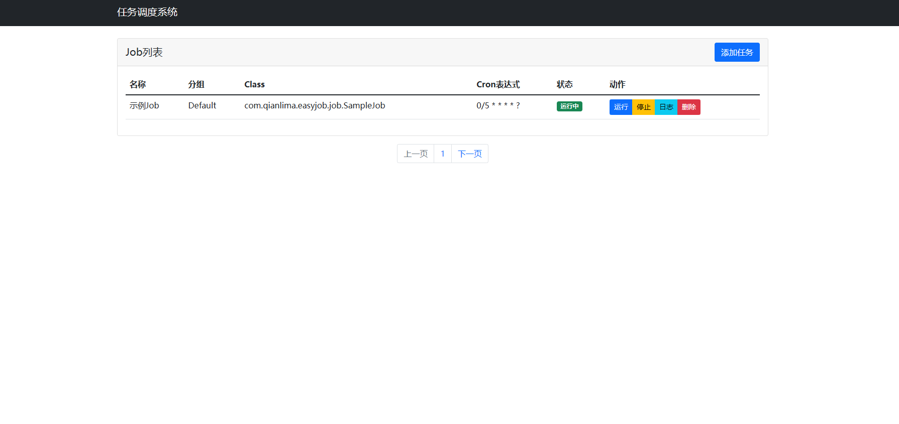
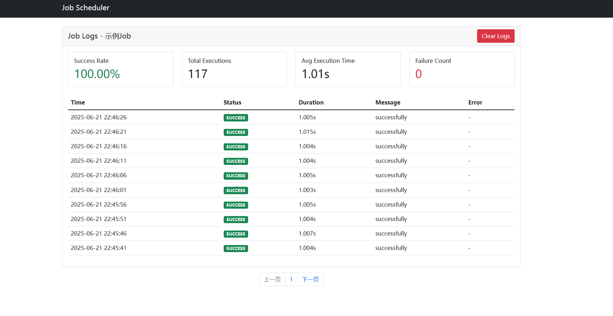

# Easy-Job

[English](#english) | [中文](#中文)

# English

## Introduction
Easy-Job is a lightweight task scheduling platform built on Spring Boot and Quartz, providing a user-friendly Web console for managing and monitoring scheduled tasks. This project aims to simplify task scheduling management and maintenance, suitable for small to medium-sized project requirements.

## Features
- 📊 Visual Console: Intuitive Web interface for task management and monitoring
- 🔒 Security: Integrated user authentication and authorization
- 📈 Task Monitoring: Real-time monitoring of task execution status and history
- 📧 Alert Notification: Email notifications for task execution exceptions
- 📝 Log Management: Detailed task execution logging
- 🎯 Flexible Configuration: Support for dynamic task configuration
- 🚀 Easy Integration: Provides Spring Boot Starter for quick integration

## Quick Start

### Requirements
- JDK 17+
- MySQL 8.0+
- Maven 3.6+

### Configuration
1. Copy `application-sample.yaml` to `application.yaml` and modify according to your environment:
   ```yaml
   spring:
     datasource:
       url: jdbc:mysql://localhost:3306/easyjob
       username: your_username
       password: your_password
   ```

2. Execute database initialization script `standalone-schema.sql`

3. Execute initial sql , please notice the password(shar256) is weak , you must change it.

   ```
   INSERT INTO job_user (`username`, `password`, `email`, `status`, `createdTime`, `updatedTime`)
   VALUES
       ('admin', '8d969eef6ecad3c29a3a629280e686cf0c3f5d5a86aff3ca12020c923adc6c92', 'admin@example.com', 1, NOW(), NOW())
   ON DUPLICATE KEY UPDATE `updatedTime` = NOW();
   ```

4. Start the application:
   ```bash
   mvn spring-boot:run
   ```

5. Access the console: http://localhost:8080
  
  

### Usage
1. Create Task: Extend `BaseJob` class to implement custom tasks
2. Configure Task: Add task configuration through Web console
3. Manage Tasks: Support task pause, resume, modify and delete
4. View Logs: Real-time task execution logs and status

## Development Guide
The project uses standard Maven project structure:
- `com.qianlima.easyjob.controller`: Web controllers
- `com.qianlima.easyjob.service`: Business logic layer
- `com.qianlima.easyjob.entity`: Data entities
- `com.qianlima.easyjob.job`: Task implementations
- `com.qianlima.easyjob.auth`: Authentication related

## License
This project is licensed under the MIT License - see the LICENSE file for details.


# 中文

## 简介
Easy-Job 是一个基于 Spring Boot 和 Quartz 构建的轻量级任务调度平台，提供了友好的 Web 控制台来管理和监控定时任务。该项目旨在简化定时任务的管理和维护工作，适用于中小型项目的任务调度需求。

## 特性
- 📊 可视化控制台：提供直观的 Web 界面，方便管理和监控任务
- 🔒 安全认证：集成用户认证和权限控制
- 📈 任务监控：实时监控任务执行状态和历史记录
- 📧 告警通知：支持任务执行异常邮件通知
- 📝 日志管理：详细的任务执行日志记录
- 🎯 灵活配置：支持动态修改任务配置
- 🚀 易于集成：提供 Spring Boot Starter，快速集成到现有项目

## 快速开始

### 环境要求
- JDK 8+
- MySQL 5.7+
- Maven 3.6+

### 配置说明
1. 复制 `application-sample.yaml` 为 `application.yaml`，根据实际情况修改配置：
   ```yaml
   spring:
     datasource:
       url: jdbc:mysql://localhost:3306/easyjob
       username: your_username
       password: your_password
   ```

2. 执行数据库初始化脚本 `standalone-schema.sql`

3. 启动应用：
   ```bash
   mvn spring-boot:run
   ```

4. 访问控制台：http://localhost:8080

### 使用说明
1. 创建任务：继承 `BaseJob` 类实现自定义任务
2. 配置任务：通过 Web 控制台添加任务配置
3. 管理任务：支持任务的暂停、恢复、修改和删除
4. 查看日志：实时查看任务执行日志和状态

## 开发指南
项目使用标准的 Maven 项目结构：
- `com.qianlima.easyjob.controller`: Web 控制器
- `com.qianlima.easyjob.service`: 业务逻辑层
- `com.qianlima.easyjob.entity`: 数据实体
- `com.qianlima.easyjob.job`: 任务实现
- `com.qianlima.easyjob.auth`: 认证相关
